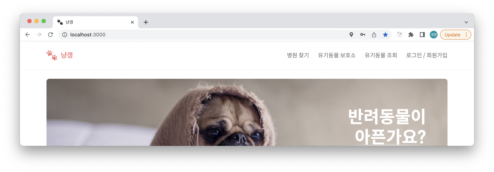
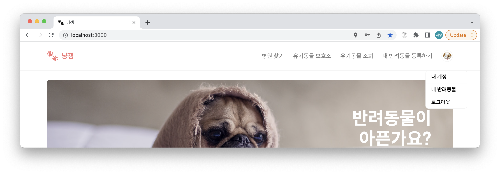
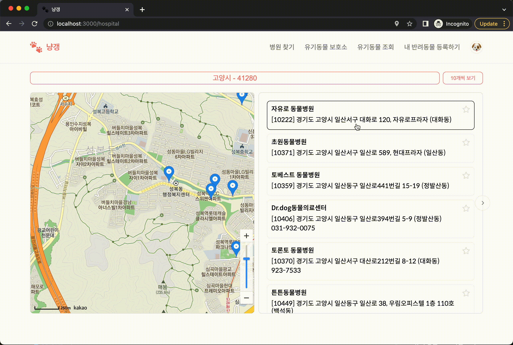

# 개인 프로젝트 : 냥갱

## 프로젝트 설명

현재 내 주변에 있는 동물 병원과 유기동물 보호소, 그리고 현재 보호 중인 유기동물의 조회 기능을 구현한 개인 프로젝트

 

## 프로젝트 진행 기간

- 프로젝트 기획 및 초안 : 2022.03.05 ~ 2022.03.12
- 프로젝트 기간 : 2022.04.14 ~ 진행 중

 

## 기술 스택

- ReactJS
- ES6
- React-Router
- styled-components
- Firebase
  - Authentication
  - Firestore
  - Firebase Storage

 

## api 목록

- [카카오맵 api](https://apis.map.kakao.com/web/guide/, "카카오맵 api 문서 이동")
- [경기도 내 등록된 동물병원](https://data.gg.go.kr/portal/data/service/selectServicePage.do?page=1&rows=10&sortColumn=&sortDirection=&infId=Y5M0CVS8XM2C821G09A813809578&infSeq=3&order=&loc=&searchWord=동물병원&BIZPLC_NM=&BSN_STATE_NM=&REFINE_ROADNM_ADDR=, "공공데이터포털 이동")
- [경기도 내 유기동물 보호 현황](https://data.gg.go.kr/portal/data/service/selectServicePage.do?page=1&sortColumn=&sortDirection=&infId=UOKOBXSYKT10BAGIDAXZ28522406&infSeq=1&searchWord=유기동물, "공공데이터포털 이동")
- [경기도 내 유기동물 보호시설 현황](https://data.gg.go.kr/portal/data/service/selectServicePage.do?page=1&rows=10&sortColumn=&sortDirection=&infId=IFCTHC90596EV59Q861V1622341&infSeq=1&order=&loc=&searchWord=유기동물, "공공데이터포털 이동")
- [경기도 청사 및 출장소 현황](https://data.gg.go.kr/portal/data/service/selectServicePage.do?page=1&rows=10&sortColumn=&sortDirection=&infId=4S17FIR05U0L2SOW82B712842838&infSeq=3&order=&loc=&searchWord=청사, "공공데이터포털 이동")
- [반려동물 등록대행업체 현황](https://data.gg.go.kr/portal/data/service/selectServicePage.do?page=1&sortColumn=&sortDirection=&infId=FD37CI7UL6TCGFW1US9028574467&infSeq=1&searchWord=동물등록, "공공데이터포털 이동")

 

<!-- ## 전체 기능 소개

### 메인 페이지 Carousel

 

- 마지막 요소에서 다음 버튼을 누르면 첫 이미지로 이동

### 회원가입

 

- Firebase Authentication 이메일 회원가입 사용
- '이메일' 입력값이 이메일 정규 표현식과 일치하면 하단의 이메일 확인하기 버튼 활성화
- '비밀번호'와 '비밀번호 확인'에 각각 입력된 값이 다르면 비밀번호 불일치 알림 텍스트 표기
- 회원가입 시 사용하고자 하는 프로필 이미지를 선택하면 미리보기로 확인 가능
- 회원가입이 완료되는 시점에 Firebase Storage에 프로필 이미지를 업로드

### 로그인

 

- Firebase Authentication 이메일 로그인 활용

### 내비게이션 바 (프로필 이미지, 드롭다운)

- 메인 페이지 로그인 여부에 따라 내비게이션 메뉴 변경
- 로그인 후 navigation bar에 해당 계정에서 회원가입 시 등록한 프로필 이미지 Firestore에서 불러와 적용

- 내비게이션 바의 계정 프로필 이미지 클릭 시 드롭다운 메뉴 open/close

### 병원 / 유기 동물 보호 시설 조회

 

- async, await 사용하여 api 사용 비동기 처리
  - Loading 중 텍스트 렌더링 후 Loading 완료 시에 화면 렌더링
- [카카오맵 api](https://apis.map.kakao.com/web/guide/, "카카오맵 api 문서 이동")를 활용하여 지도 구현
- 페이지 접속 시 geolocation api를 통해 사용자의 현재 위치에 접근하고 지도의 중심을 현재 위치로 설정
  - 현재 위치 접근 실패 시 경기도청을 중심 좌표로 설정

 

 

- 리스트에서 병원이나 보호 시설 선택 시 해당 업체의 위치를 지도의 중심으로 설정

 

 

- 도시 필터링 기능 적용

 

 

- 리스트 표시 개수 선택 기능 및 Pagination 적용

#### 병원 조회

- [경기도 내 등록된 동물 병원(공공데이터포털)](https://data.gg.go.kr/portal/data/service/selectServicePage.do?page=1&rows=10&sortColumn=&sortDirection=&infId=Y5M0CVS8XM2C821G09A813809578&infSeq=3&order=&loc=&searchWord=동물병원&BIZPLC_NM=&BSN_STATE_NM=&REFINE_ROADNM_ADDR=, "공공데이터포털 이동")

#### 유기 동물 보호 시설 조회

- [경기도 내 유기동물 보호시설 현황(공공데이터포털)](https://data.gg.go.kr/portal/data/service/selectServicePage.do?page=1&sortColumn=&sortDirection=&infId=UOKOBXSYKT10BAGIDAXZ28522406&infSeq=1&searchWord=유기동물, "공공데이터포털 이동") -->
