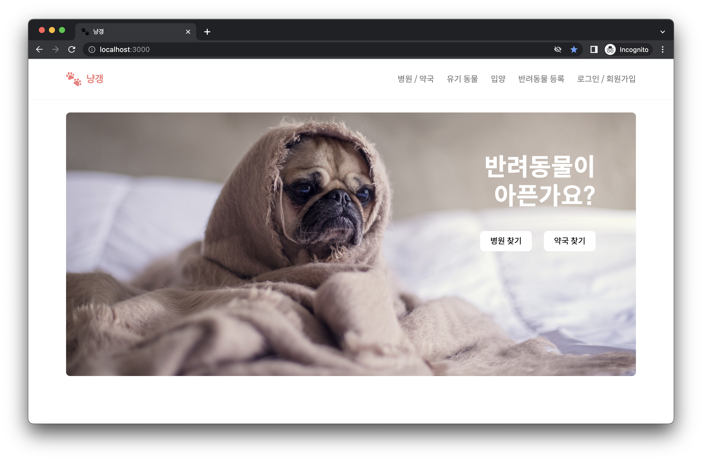

# 🐾 냥갱

## 📄 프로젝트 설명

동물 병원/약국, 유기동물 보호소, 현재 보호 중인 유기동물 조회 기능 및 게시판 등의 기능을 구현한 개인 프로젝트

 

## 🗓 프로젝트 진행 기간

- 기획 및 초안 : 2022.03.05 ~ 2022.03.12
- 디자인 및 개발 기간 : 2022.04.14 ~ 2022.05.20
- 유지 보수 및 리팩토링 : 2022.05.21 ~

 

## 📚 기술 스택

- ReactJS
- ES6
- React-Router
- styled-components
- Redux
- Firebase
  - Authentication
  - Firestore
  - Firebase Storage

 

## 📑 api 목록

- [카카오맵 api](https://apis.map.kakao.com/web/guide/, "카카오맵 api 문서 이동")
- [경기도 내 등록된 동물병원](https://data.gg.go.kr/portal/data/service/selectServicePage.do?page=1&rows=10&sortColumn=&sortDirection=&infId=Y5M0CVS8XM2C821G09A813809578&infSeq=3&order=&loc=&searchWord=동물병원&BIZPLC_NM=&BSN_STATE_NM=&REFINE_ROADNM_ADDR=, "공공데이터포털 이동")
- [경기도 내 동물약국 현황](https://data.gg.go.kr/portal/data/service/selectServicePage.do?page=1&rows=10&sortColumn=&sortDirection=&infId=1664G9P3897924K608Z3588543&infSeq=3&order=&loc=&searchWord=동물약국, "공공데이터포털 이동")
- [경기도 내 유기동물 보호 현황](https://data.gg.go.kr/portal/data/service/selectServicePage.do?page=1&sortColumn=&sortDirection=&infId=UOKOBXSYKT10BAGIDAXZ28522406&infSeq=1&searchWord=유기동물, "공공데이터포털 이동")
- [경기도 내 유기동물 보호시설 현황](https://data.gg.go.kr/portal/data/service/selectServicePage.do?page=1&rows=10&sortColumn=&sortDirection=&infId=IFCTHC90596EV59Q861V1622341&infSeq=1&order=&loc=&searchWord=유기동물, "공공데이터포털 이동")
- [경기도 청사 및 출장소 현황](https://data.gg.go.kr/portal/data/service/selectServicePage.do?page=1&rows=10&sortColumn=&sortDirection=&infId=4S17FIR05U0L2SOW82B712842838&infSeq=3&order=&loc=&searchWord=청사, "공공데이터포털 이동")
- [반려동물 등록대행업체 현황](https://data.gg.go.kr/portal/data/service/selectServicePage.do?page=1&sortColumn=&sortDirection=&infId=FD37CI7UL6TCGFW1US9028574467&infSeq=1&searchWord=동물등록, "공공데이터포털 이동")

 

## 👀 프로젝트 상세 내용

- [프로젝트 보러가기 📝](https://abounding-primrose-d9a.notion.site/60cdd0d1c2f24a488bbfb0cb9df115f5, "Notion으로 이동")
- [시연 영상 🎬](https://drive.google.com/file/d/1AGNiThBoy7zJX6zi_sgGa7Kt8F-29L1B/view, "Google Drive로 이동")
